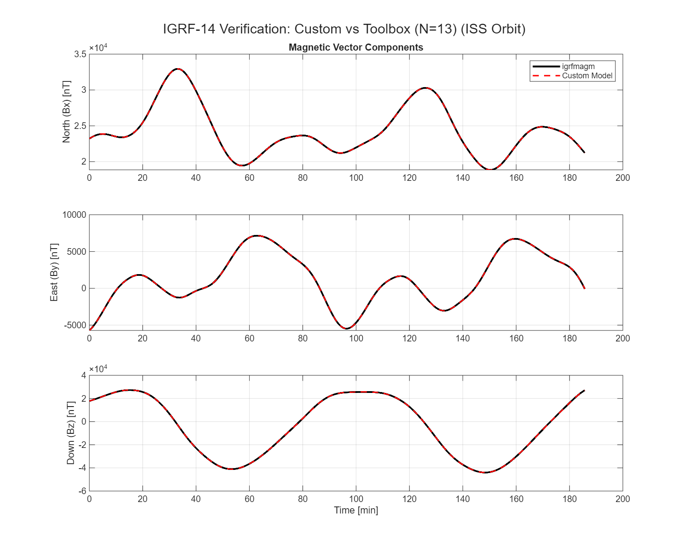
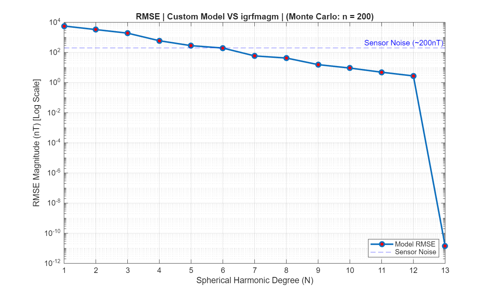

# IGRF-13 Geomagnetic Field Model (WGS84)

A high-fidelity MATLAB implementation of the International Geomagnetic Reference Field (IGRF-13) model for Low Earth Orbit (LEO) applications. 

This core module is designed as a reference verification tool for CubeSat Attitude Determination and Control Systems (ADCS).

## Features

- **High Fidelity:** Implements IGRF-13 generation up to degree/order 13.
- **Geodetic Accuracy:** Includes a rigorous WGS84 Geodetic-to-Geocentric coordinate transformation (accounting for Earth's oblateness), ensuring high accuracy at variable altitudes.
- **Schmidt Quasi-Normalization:** Correctly handles spherical harmonic normalization/un-normalization.
- **Secular Variation:** Linear time interpolation for precise field estimation between epoch years.

## Usage

```matlab
% Load coefficients
load('../data/igrf14coeffs.mat', 'C_nm');

% Define position (e.g., ISTNanoSat Orbit)
height = 400000;    % 400 km
lat    = 38.7223;   % Lisbon Latitude
lon    = -9.1393;   % Lisbon Longitude
year   = 2025.5;    % Date
N      = 13;        % Expansion order

% Compute Field
[B_ned, F] = magnetic_field(height, lat, lon, year, C_nm, N);

disp(['Total Intensity: ', num2str(F), ' nT']);

```
## Verification Results

### 1. Vector Comparison (Custom vs MATLAB Aerospace Toolbox)
The following plot compares the North, East, and Down magnetic vector components over 2 orbits.
<p align="center">
  
</p>

### 2. RMSE Convergence
A Monte Carlo analysis showing the Root Mean Square Error (RMSE) of the custom model converging to the MATLAB reference as the spherical harmonic degree (N) increases.
<p align="center">
  
</p>
